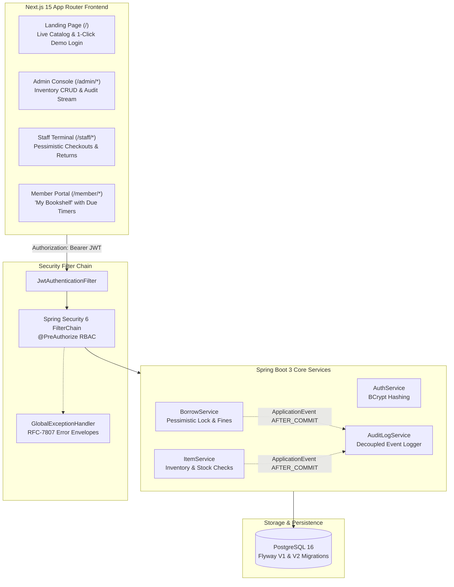

# LibraVault — Enterprise Library & Inventory Management System

[](#automated-testing--cicd)
[](https://spring.io/projects/spring-boot)
[](https://openjdk.org/)
[](https://www.postgresql.org/)
[](https://nextjs.org/)
[](https://tailwindcss.com/)
[](https://www.docker.com/)
[](https://kubernetes.io/)

A full-stack, cloud-native enterprise library and inventory management application designed to showcase **Spring Boot 3**, **Spring Security 6 with stateless JWT authentication**, **Role-Based Access Control (RBAC)**, **Pessimistic Database Locking (`SELECT ... FOR UPDATE`)**, **Event-Driven Audit Trails (`@TransactionalEventListener`)**, and a **Next.js 15 App Router** frontend.

---

## Architecture Overview



---

## Key Technical Features

### 1. Concurrency Safeguards & Race Condition Protection
* **Pessimistic Write Locking (`@Lock(LockModeType.PESSIMISTIC_WRITE)`)**:
  When concurrent requests attempt to check out the last available copy of a high-demand book, PostgreSQL serializes row access with `SELECT ... FOR UPDATE`.
  * Verified by multi-threaded automated test suites (`BorrowConcurrencyIntegrationTests`): 5 concurrent threads competing for 1 copy results in exactly 1 checkout and 4 safe `409 Conflict` rejections.

### 2. Stateless Spring Security 6 & Method-Level RBAC
* **HMAC-SHA256 JWT Authentication** via JJWT `0.12.6`.
* **Zero HTML Error Pages**: Filter-level exceptions are bridged through `HandlerExceptionResolver` directly to `@RestControllerAdvice` (`GlobalExceptionHandler`), returning standardized JSON error envelopes.
* **Declarative RBAC**: Endpoints protected by `@PreAuthorize("hasRole('ADMIN')")`, `@PreAuthorize("hasRole('STAFF')")`, and `@PreAuthorize("hasRole('MEMBER')")`.

### 3. Decoupled Event-Driven Audit Trail
* **Phantom Log Prevention**: Business actions emit Spring `AuditEvent` instances handled by `@TransactionalEventListener(phase = TransactionPhase.AFTER_COMMIT)`.
* If a borrow transaction rolls back, zero audit records are persisted.

### 4. Role-Tailored Frontend Experience
* **1-Click Demo Persona Login**: Instant pre-fill chips for Admin, Staff, and Member credentials on `/login` and `/`.
* **Member "My Bookshelf"**: Real-time due-date countdown chips (*"Due in 4 days"*, *"Due today"*, *"Overdue by 2 days"*).
* **Staff Circulation Desk**: Check-in and checkout terminals with automated late fine calculation ($0.50/day).
* **Admin Inventory & Audit Console**: Full CRUD modal workflows and chronological system event streams.

---

## Seeded Demo Credentials

| Role | Email Address | Password | Accessible Portals |
| :--- | :--- | :--- | :--- |
| **Administrator** | `admin@libravault.com` | `Password@123` | `/admin/inventory`, `/admin/audit`, `/`, `/api/*` |
| **Staff Member** | `staff@libravault.com` | `Password@123` | `/staff/checkout`, `/staff/returns`, `/staff/overdue`, `/` |
| **Library Member** | `member@libravault.com` | `Password@123` | `/member/bookshelf`, `/` |

---

## Quickstart & Local Setup

### Option 1: Unified Docker Compose (Recommended)
Clone the repository and run the full 3-tier stack:
```bash
docker compose up --build
```
* **Frontend Web Application**: `http://localhost:3000`
* **Backend REST API**: `http://localhost:8080`
* **Swagger OpenAPI Documentation**: `http://localhost:8080/swagger-ui.html`
* **Actuator Health Probe**: `http://localhost:8080/actuator/health`

---

### Option 2: Running Locally (Development Mode)

#### 1. Start PostgreSQL via Docker Compose
```bash
docker compose up -d postgres
```

#### 2. Start Spring Boot Backend
```bash
cd backend
mvn spring-boot:run
```

#### 3. Start Next.js Frontend
```bash
cd frontend
npm install
npm run dev
```
Visit `http://localhost:3000` in your browser.

---

## Automated Testing & CI/CD

### Backend Test Suite (40/40 Tests Passing)
Run the automated test suite covering unit tests, integration tests, and multi-threaded concurrency locking tests:
```bash
mvn test -f backend/pom.xml
```

### Frontend Production Build Verification
```bash
cd frontend
npm run build
```

### GitHub Actions CI/CD
Located in [`.github/workflows/ci-cd.yml`](.github/workflows/ci-cd.yml), automatically validating Java tests, Next.js static builds, and Docker Compose configurations on every pull request.

---

## Kubernetes Cloud Deployment (`k8s/`)

Deploy to any Kubernetes cluster (EKS, GKE, AKS, Minikube, or K3s):
```bash
kubectl apply -f k8s/configmap-secrets.yaml
kubectl apply -f k8s/postgres-statefulset.yaml
kubectl apply -f k8s/backend-deployment.yaml
kubectl apply -f k8s/frontend-deployment.yaml
kubectl apply -f k8s/ingress.yaml
```

---

## Weekly Engineering Documentation & Learning Manuals

| Phase | Topics & Focus | Documentation | Learning Manual |
| :--- | :--- | :--- | :--- |
| **Week 1** | PostgreSQL 16, Flyway V1/V2, JPA Entities, Repositories | [docs/week-01/README.md](docs/week-01/README.md) | [docs/week-01/LEARNING_MANUAL.md](docs/week-01/LEARNING_MANUAL.md) |
| **Week 2** | Spring Security 6, JWT, RBAC `@PreAuthorize`, RFC Error Envelopes | [docs/week-02/README.md](docs/week-02/README.md) | [docs/week-02/LEARNING_MANUAL.md](docs/week-02/LEARNING_MANUAL.md) |
| **Week 3** | Pessimistic Locking, Fine Engine, Event-Driven Audit Trails | [docs/week-03/README.md](docs/week-03/README.md) | [docs/week-03/LEARNING_MANUAL.md](docs/week-03/LEARNING_MANUAL.md) |
| **Week 4** | Next.js App Router, Typed API Client, Admin & Staff Portals | [docs/week-04/README.md](docs/week-04/README.md) | [docs/week-04/LEARNING_MANUAL.md](docs/week-04/LEARNING_MANUAL.md) |
| **Week 5** | Member Bookshelf, Due-date Timers, UI Polish & Micro-interactions | [docs/week-05/README.md](docs/week-05/README.md) | [docs/week-05/LEARNING_MANUAL.md](docs/week-05/LEARNING_MANUAL.md) |
| **Week 6** | Multi-stage Docker, K8s Manifests, CI/CD & Cloud Deployment | [docs/week-06/README.md](docs/week-06/README.md) | [docs/week-06/LEARNING_MANUAL.md](docs/week-06/LEARNING_MANUAL.md) |
