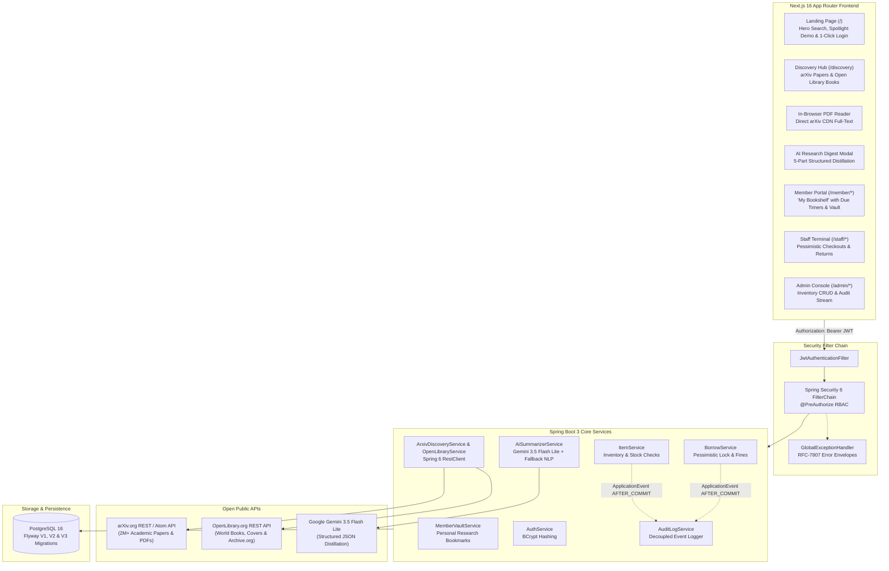

# LibraVault — Enterprise Library & Inventory Management System

[](#automated-testing--cicd)
[](https://spring.io/projects/spring-boot)
[](https://openjdk.org/)
[](https://www.postgresql.org/)
[](https://nextjs.org/)
[](https://tailwindcss.com/)
[](https://www.docker.com/)
[](https://kubernetes.io/)

A full-stack, cloud-native enterprise library, digital research, and inventory management platform designed to showcase **Spring Boot 3**, **Spring Security 6 with stateless JWT authentication**, **Live Academic Paper Discovery (arXiv API)**, **World Literature Search (Open Library API)**, **AI Paper Summarization (Google Gemini & Heuristic NLP)**, **Pessimistic Database Locking (`SELECT ... FOR UPDATE`)**, **Event-Driven Audit Trails (`@TransactionalEventListener`)**, and a **Next.js 16 App Router** frontend with in-browser PDF reading.

---

## Architecture Overview


```mermaid
graph TD
    subgraph FrontendLayer [Next.js 16 App Router Frontend]
        LandingUI["Landing Page (/)<br/>Hero Search, Spotlight Demo & 1-Click Login"]
        DiscUI["Discovery Hub (/discovery)<br/>arXiv Papers & Open Library Books"]
        PDFReader["In-Browser PDF Reader<br/>Direct arXiv CDN Full-Text"]
        AIDrawer["AI Research Digest Modal<br/>5-Part Structured Distillation"]
        MemberUI["Member Portal (/member/*)<br/>'My Bookshelf' with Due Timers & Vault"]
        StaffUI["Staff Terminal (/staff/*)<br/>Pessimistic Checkouts & Returns"]
        AdminUI["Admin Console (/admin/*)<br/>Inventory CRUD & Audit Stream"]
    end

    subgraph SecurityGateway [Security Filter Chain]
        JWTFilter[JwtAuthenticationFilter]
        SecConfig[Spring Security 6 FilterChain<br/>@PreAuthorize RBAC]
        ExcHandler[GlobalExceptionHandler<br/>RFC-7807 Error Envelopes]
    end

    subgraph BusinessDomain [Spring Boot 3 Core Services]
        DiscSvc[ArxivDiscoveryService & OpenLibraryService<br/>Spring 6 RestClient]
        AISvc[AiSummarizerService<br/>Gemini 3.5 Flash Lite + Fallback NLP]
        VaultSvc[MemberVaultService<br/>Personal Research Bookmarks]
        AuthSvc[AuthService<br/>BCrypt Hashing]
        ItemSvc[ItemService<br/>Inventory & Stock Checks]
        BorrowSvc[BorrowService<br/>Pessimistic Lock & Fines]
        AuditSvc[AuditLogService<br/>Decoupled Event Logger]
    end

    subgraph ExternalAPIs [Open Public APIs]
        ArxivAPI["arXiv.org REST / Atom API<br/>(2M+ Academic Papers & PDFs)"]
        OpenLibAPI["OpenLibrary.org REST API<br/>(World Books, Covers & Archive.org)"]
        GeminiAPI["Google Gemini 3.5 Flash Lite<br/>(Structured JSON Distillation)"]
    end

    subgraph DataLayer [Storage & Persistence]
        Postgres[(PostgreSQL 16<br/>Flyway V1, V2 & V3 Migrations)]
    end

    FrontendLayer -->|Authorization: Bearer JWT| JWTFilter
    JWTFilter --> SecConfig
    SecConfig --> BusinessDomain
    SecConfig -.-> ExcHandler
    DiscSvc --> ArxivAPI
    DiscSvc --> OpenLibAPI
    AISvc --> GeminiAPI
    BorrowSvc -.->|ApplicationEvent AFTER_COMMIT| AuditSvc
    ItemSvc -.->|ApplicationEvent AFTER_COMMIT| AuditSvc
    BusinessDomain --> Postgres
```

---

## Key Technical Features

### 1. Live Academic Paper & Global Book Discovery
* **arXiv Open Research Integration**: Queries 2M+ scientific papers across Artificial Intelligence, Software Engineering, Distributed Systems, Cryptography, and Mathematics.
* **In-Browser Full-Text PDF Reader**: Stream and read open-access research papers directly inside the app with fullscreen mode and download capabilities.
* **Open Library Integration**: Search millions of published books with high-resolution cover art, publication history, and direct links to public domain editions on the Internet Archive.

### 2. AI Paper Assistant Microservice
* **5-Part Structured Distillation**: Translates complex abstracts into:
  1. *Executive TL;DR*
  2. *Research Bottleneck & Core Problem*
  3. *Methodology & Key Innovations*
  4. *Benchmark Findings & SOTA Results*
  5. *Engineering & Production Applications*
* **Dual-Engine Resilience**: Seamlessly connects to Google Gemini 3.5 Flash Lite when an API key is configured, and automatically falls back to an extractive heuristic NLP engine when offline or without external credentials.

### 3. Concurrency Safeguards & Race Condition Protection
* **Pessimistic Write Locking (`@Lock(LockModeType.PESSIMISTIC_WRITE)`)**:
  When concurrent requests attempt to check out the last available copy of a high-demand book, PostgreSQL serializes row access with `SELECT ... FOR UPDATE`.
  * Verified by multi-threaded automated test suites (`BorrowConcurrencyIntegrationTests`): 5 concurrent threads competing for 1 copy results in exactly 1 checkout and 4 safe `409 Conflict` rejections.

### 4. Stateless Spring Security 6 & Method-Level RBAC
* **HMAC-SHA256 JWT Authentication** via JJWT `0.12.6`.
* **Zero HTML Error Pages**: Filter-level exceptions are bridged through `HandlerExceptionResolver` directly to `@RestControllerAdvice` (`GlobalExceptionHandler`), returning standardized JSON error envelopes.
* **Declarative RBAC**: Endpoints protected by `@PreAuthorize("hasRole('ADMIN')")`, `@PreAuthorize("hasRole('STAFF')")`, and `@PreAuthorize("hasRole('MEMBER')")`.

### 5. Decoupled Event-Driven Audit Trail
* **Phantom Log Prevention**: Business actions emit Spring `AuditEvent` instances handled by `@TransactionalEventListener(phase = TransactionPhase.AFTER_COMMIT)`.
* If a borrow transaction rolls back, zero audit records are persisted.

### 6. Role-Tailored Frontend Experience
* **1-Click Demo Persona Login**: Instant pre-fill chips for Admin, Staff, and Member credentials on `/login` and `/`.
* **Member "My Bookshelf & Digital Vault"**: Unified tracking of physical borrowed books with real-time due-date countdown chips and saved digital research papers.
* **Staff Circulation Desk**: Check-in and checkout terminals with automated late fine calculation ($0.50/day).
* **Admin Inventory & Audit Console**: Full CRUD modal workflows and chronological system event streams.

---

## Seeded Demo Credentials

| Role | Email Address | Password | Accessible Portals |
| :--- | :--- | :--- | :--- |
| **Public / Guest** | *(No credentials needed)* | — | `/`, `/catalog`, `/discovery` |
| **Administrator** | `admin@libravault.com` | `Password@123` | `/admin/inventory`, `/admin/audit`, `/discovery`, `/`, `/api/*` |
| **Staff Member** | `staff@libravault.com` | `Password@123` | `/staff/checkout`, `/staff/returns`, `/staff/overdue`, `/discovery`, `/` |
| **Library Member** | `member@libravault.com` | `Password@123` | `/member/bookshelf`, `/discovery`, `/` |

---

## Quickstart & Local Setup

### Option 1: Unified Docker Compose (Recommended)
Clone the repository and run the full 3-tier stack:
```bash
docker compose up --build
```
* **Frontend Web Application**: `http://localhost:3000`
* **Live Discovery & AI Portal**: `http://localhost:3000/discovery`
* **Backend REST API**: `http://localhost:8080`
* **Swagger OpenAPI Documentation**: `http://localhost:8080/swagger-ui.html`
* **Actuator Health Probe**: `http://localhost:8080/actuator/health`

---

### Option 2: Running Locally (Development Mode)

#### 1. Start PostgreSQL via Docker Compose
```bash
docker compose up -d postgres
```

#### 2. Start Spring Boot Backend
```bash
cd backend
mvn spring-boot:run
```

#### 3. Start Next.js Frontend
```bash
cd frontend
npm install
npm run dev
```
Visit `http://localhost:3000` in your browser.

---

## Automated Testing & CI/CD

### Backend Test Suite (40/40 Tests Passing)
Run the automated test suite covering unit tests, integration tests, and multi-threaded concurrency locking tests:
```bash
mvn test -f backend/pom.xml
```

### Frontend Production Build Verification
```bash
cd frontend
npm run build
```

### GitHub Actions CI/CD
Located in [`.github/workflows/ci-cd.yml`](.github/workflows/ci-cd.yml), automatically validating Java tests, Next.js static builds, and Docker Compose configurations on every pull request.

---

## Kubernetes Cloud Deployment (`k8s/`)

Deploy to any Kubernetes cluster (EKS, GKE, AKS, Minikube, or K3s):
```bash
kubectl apply -f k8s/configmap-secrets.yaml
kubectl apply -f k8s/postgres-statefulset.yaml
kubectl apply -f k8s/backend-deployment.yaml
kubectl apply -f k8s/frontend-deployment.yaml
kubectl apply -f k8s/ingress.yaml
```
